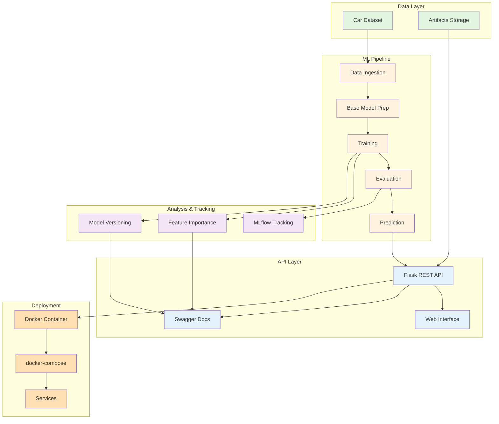
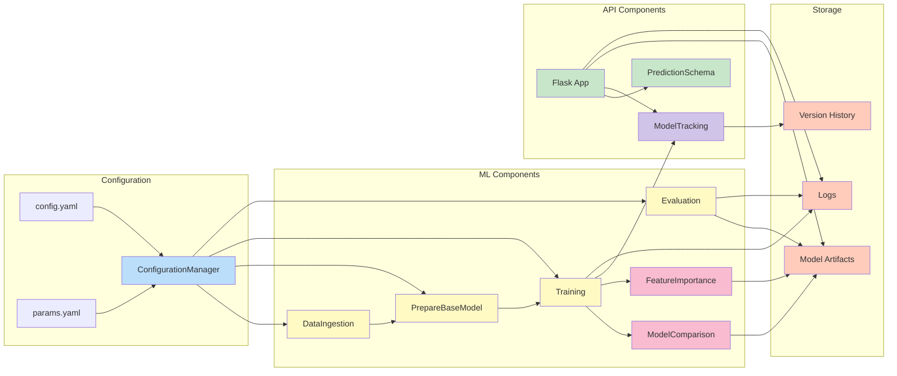
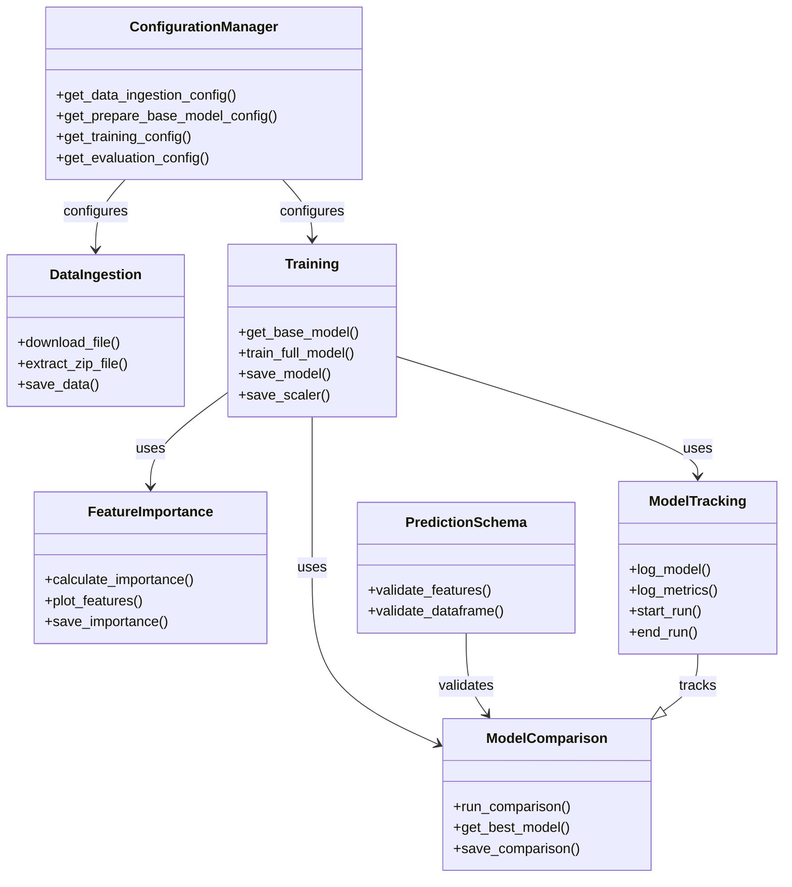
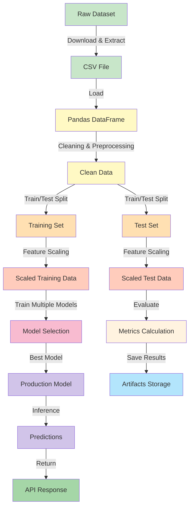
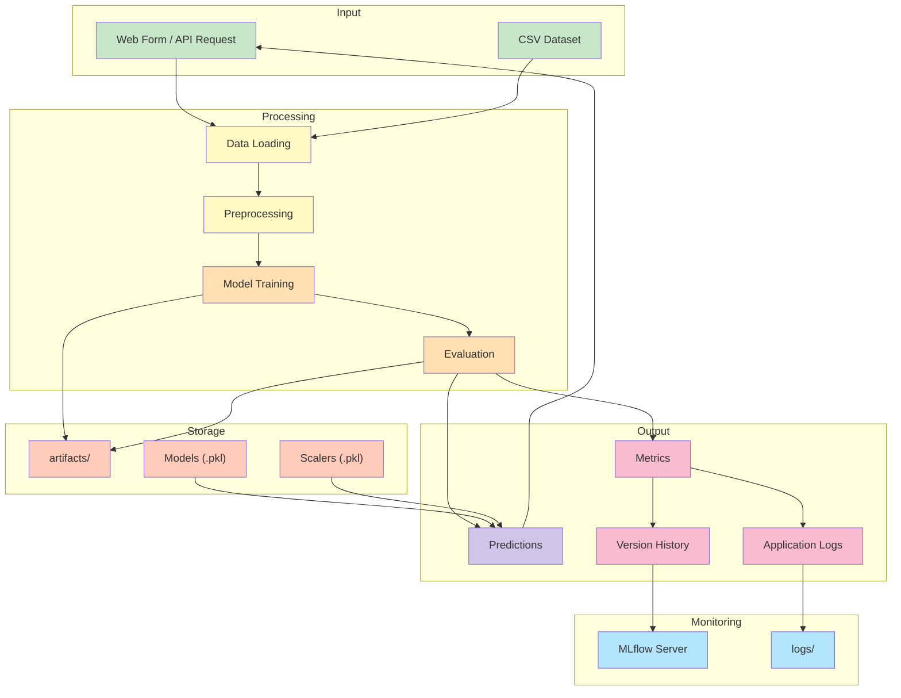

# System Architecture

This document describes the overall system architecture of the Car Price Prediction project.

## High-Level System Architecture

## Component Relationships

## Module Organization

## Data Flow Overview

## System Integration Points

---

## Key Integration Points

1. **Configuration Management** - Centralized config via ConfigurationManager
2. **Data Pipeline** - Sequential processing through stages
3. **Model Persistence** - Artifacts storage and versioning
4. **API Integration** - REST endpoints consume trained models
5. **Monitoring** - MLflow tracks experiments and metrics
6. **Logging** - Comprehensive logging throughout pipeline

---

## Scalability Considerations

- **Horizontal Scaling** - docker-compose allows multiple API instances
- **Data Scaling** - Batch processing for large datasets
- **Model Scaling** - Parallel training and evaluation
- **Storage Scaling** - Artifacts organized in versioned directories

