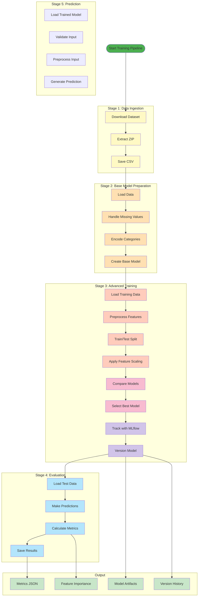
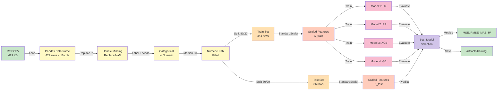
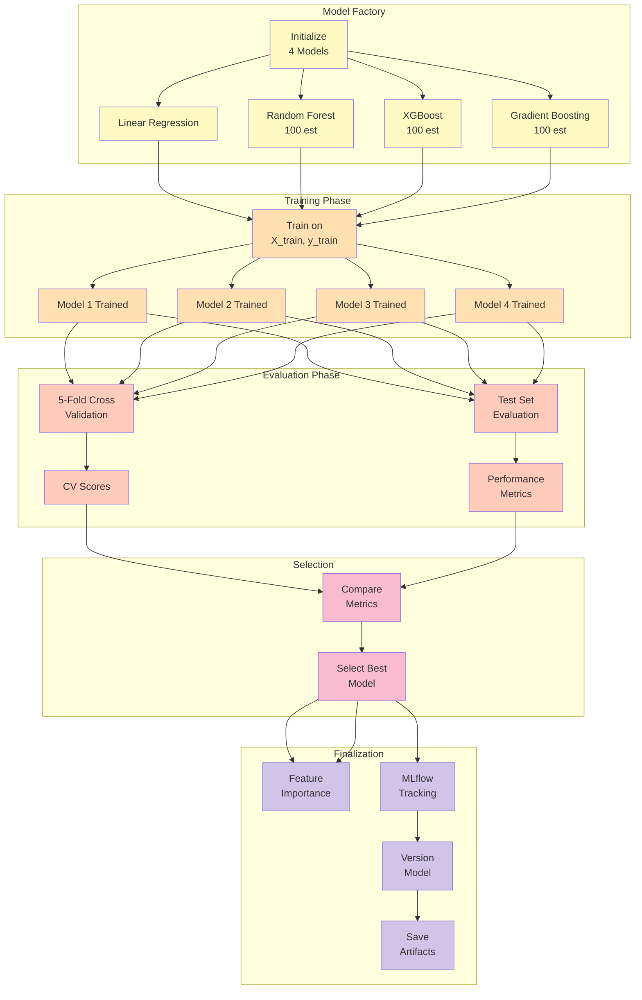
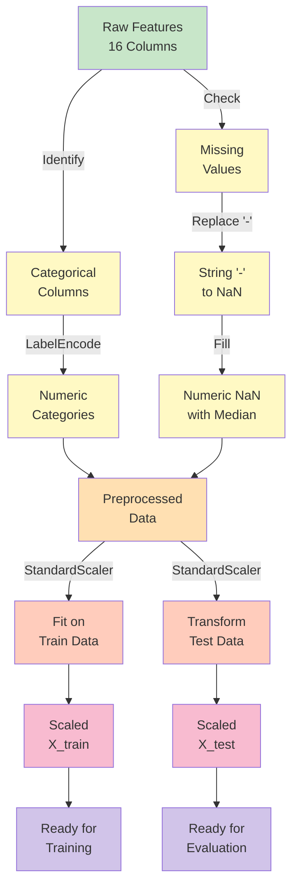
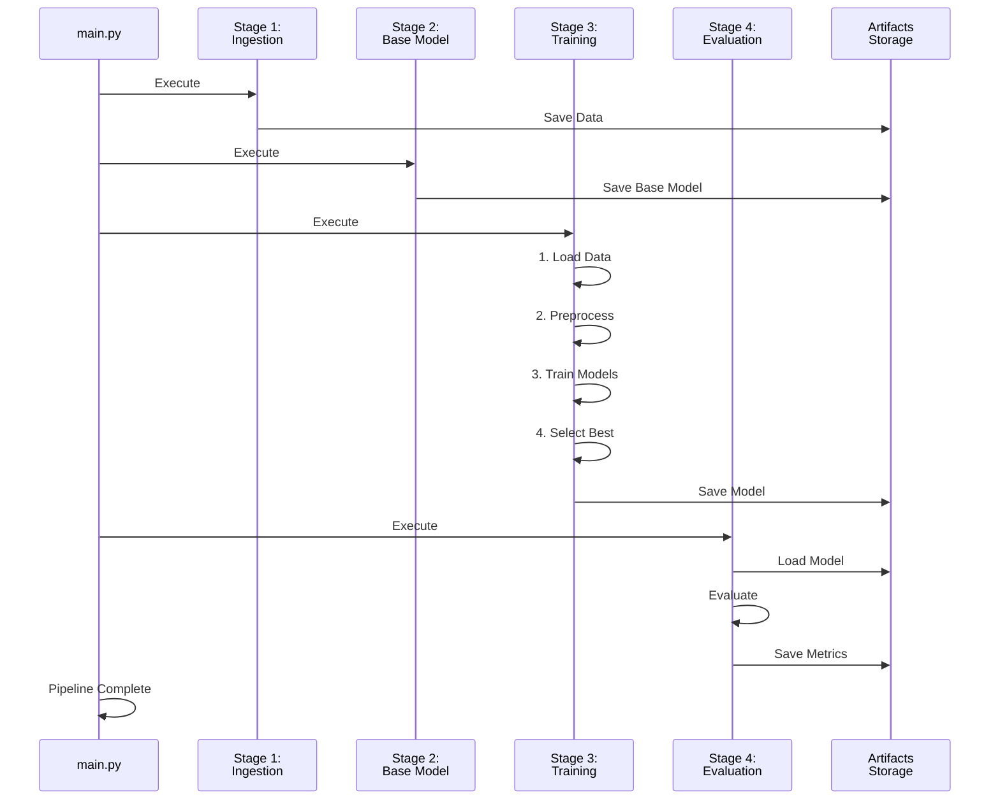
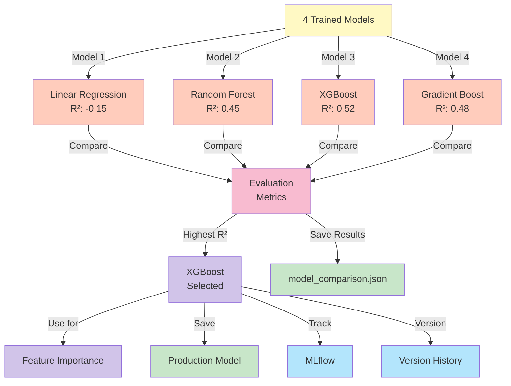

# ML Pipeline Architecture

This document describes the machine learning pipeline with all 5 stages and their interactions.

## Complete ML Pipeline Flow

## Data Transformation Pipeline

## Model Training Workflow

## Data Preprocessing Details

## Pipeline Execution Order

## Model Selection Process

---

## Key Metrics Tracked

| Stage | Metrics | Output |
|-------|---------|--------|
| **Stage 3** | CV R², Test R², RMSE, MAE, MSE | model_comparison.json |
| **Stage 4** | R², RMSE, MAE, MSE | scores.json |
| **Training** | Feature Importance | feature_importance.csv |
| **Tracking** | Experiment metrics | MLflow Server |

---

## Pipeline Configuration

- **Cross-Validation Folds:** 5
- **Train/Test Split:** 80/20
- **Feature Scaling:** StandardScaler
- **Random State:** 42
- **Number of Models:** 4
- **Feature Count:** 16

