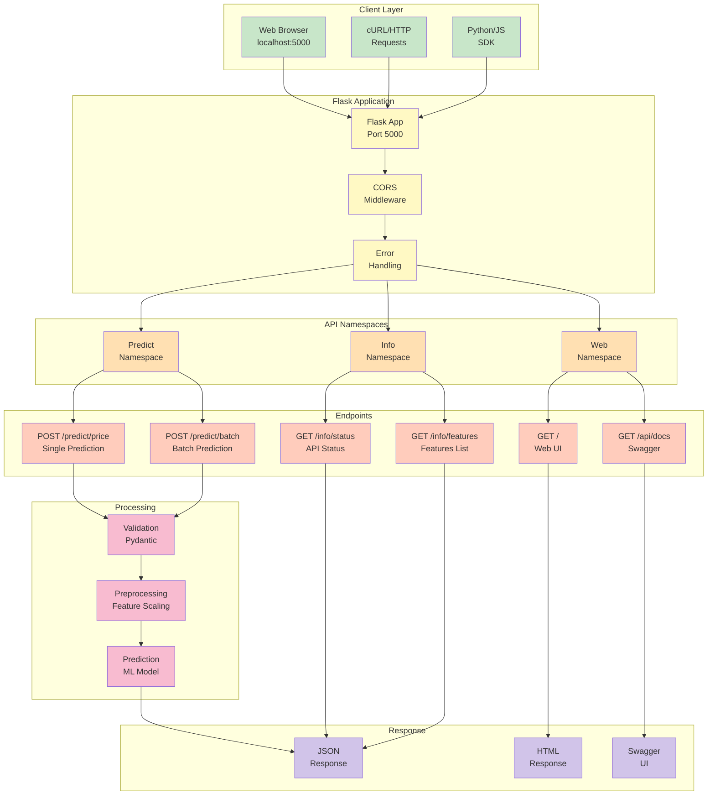
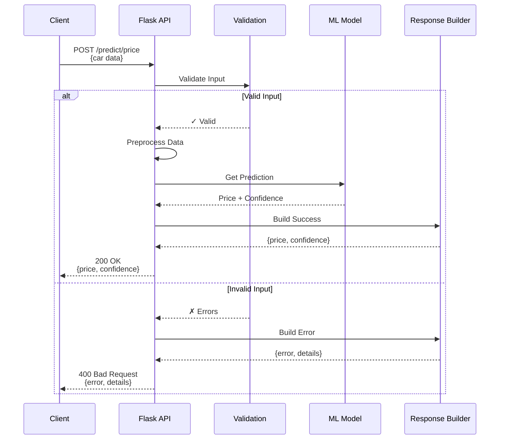
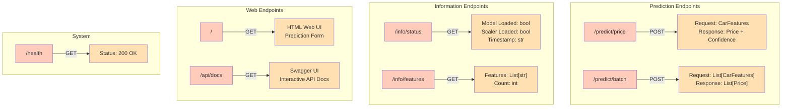
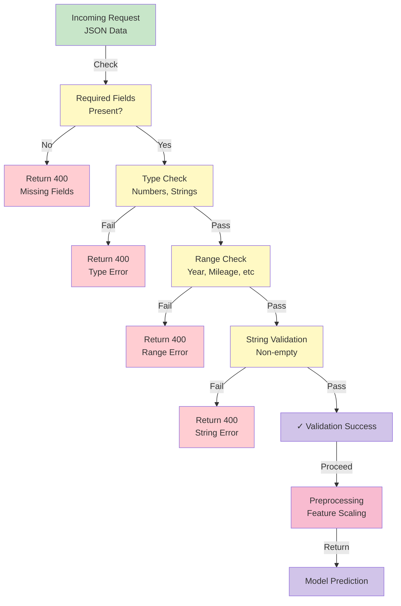
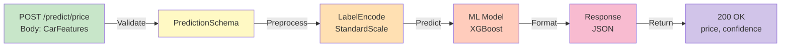
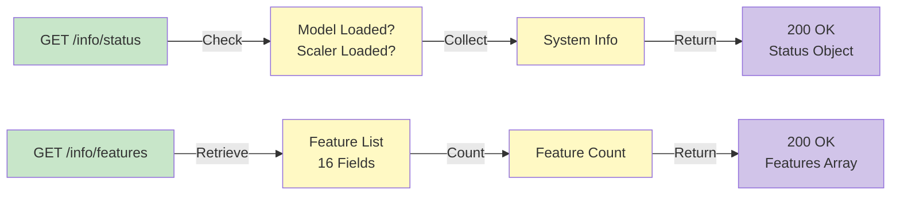
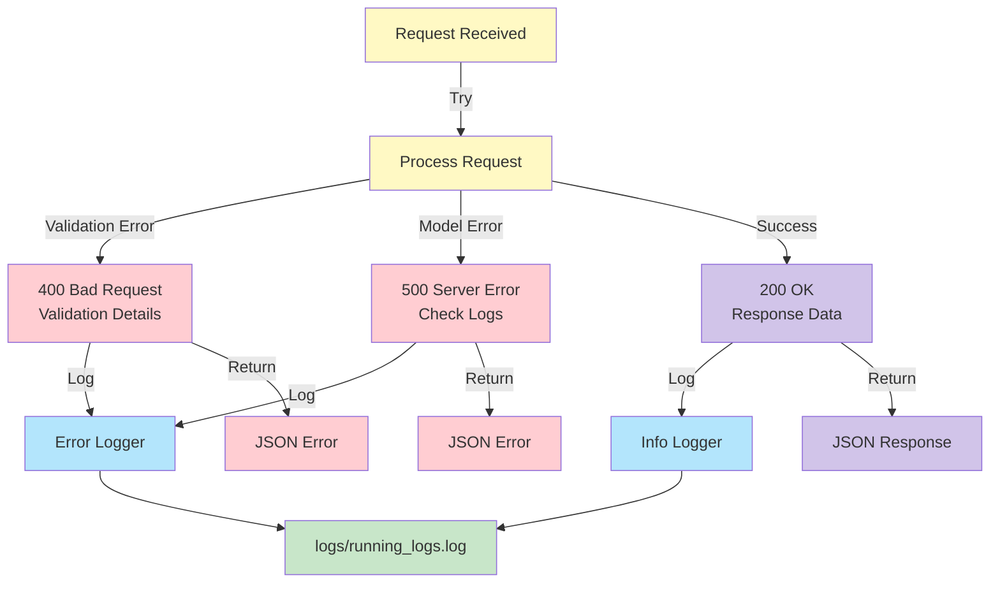
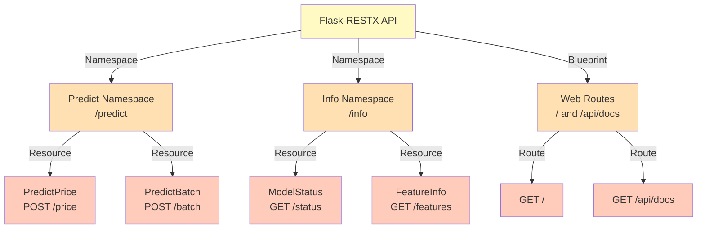
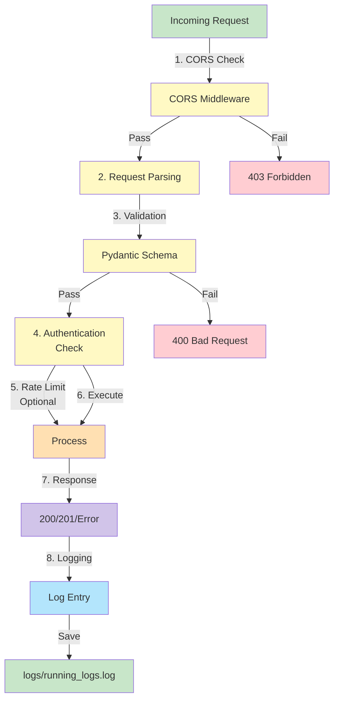

# API Architecture

This document describes the REST API structure, endpoints, and request/response flows.

## API Architecture Overview



## Request/Response Flow



## API Endpoints Structure



## Data Validation Pipeline



## Endpoint Details

### Prediction Endpoint: /predict/price



### Information Endpoints



## Error Handling Flow



## API Namespace Organization



## API Security & Middleware



---

## Response Format Examples

### Success Response (200 OK)
```json
{
  "price": 15234.50,
  "confidence": 0.85,
  "features_received": 16
}
```

### Error Response (400 Bad Request)
```json
{
  "error": "Validation failed",
  "details": [
    {
      "field": "Prod. year",
      "message": "Value must be between 1900 and 2030"
    }
  ]
}
```

### Status Response (200 OK)
```json
{
  "model_loaded": true,
  "scaler_loaded": true,
  "model_path": "artifacts/training/model.pkl",
  "scaler_path": "artifacts/training/scaler.pkl",
  "timestamp": "2024-01-15T10:30:00"
}
```

