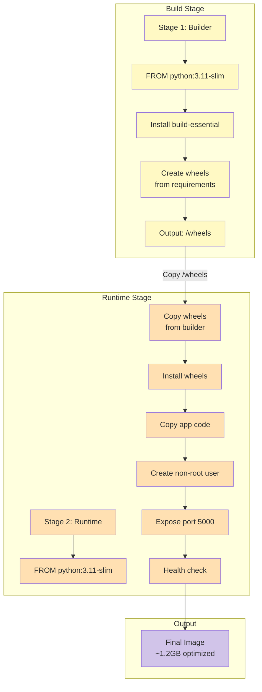
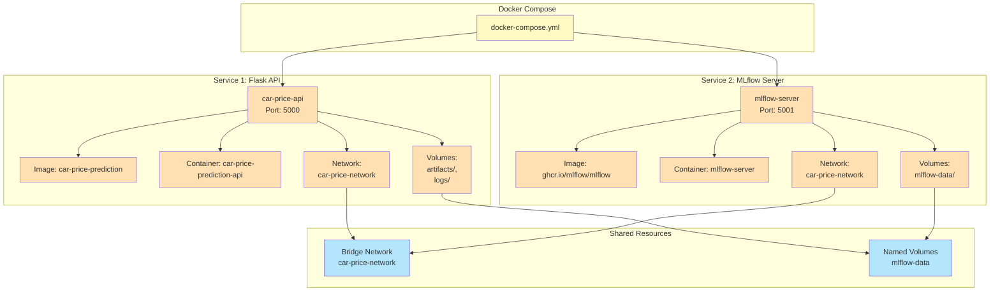
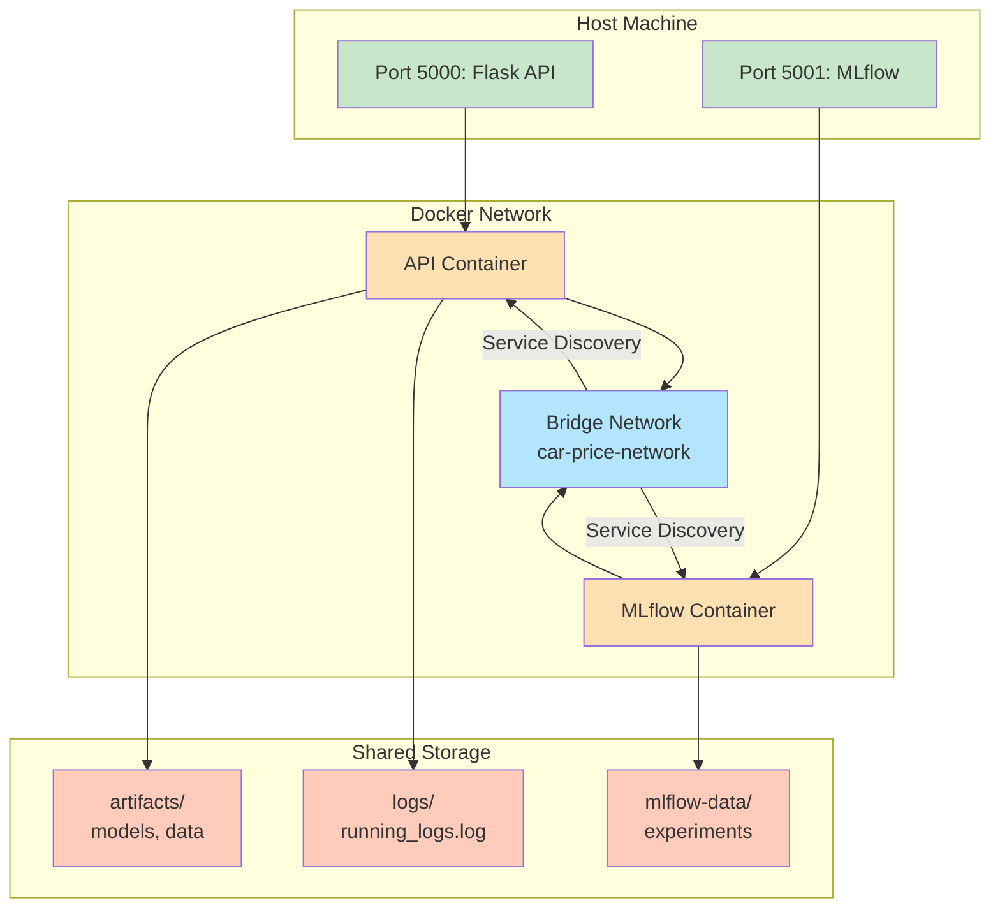
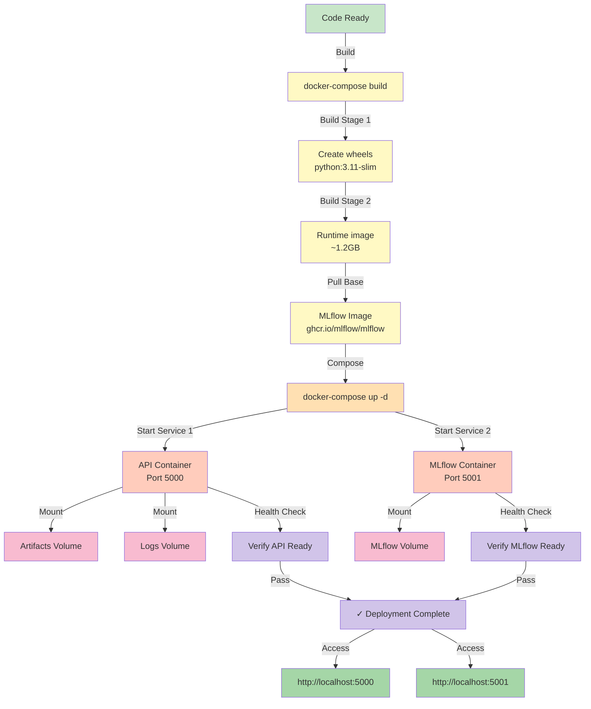
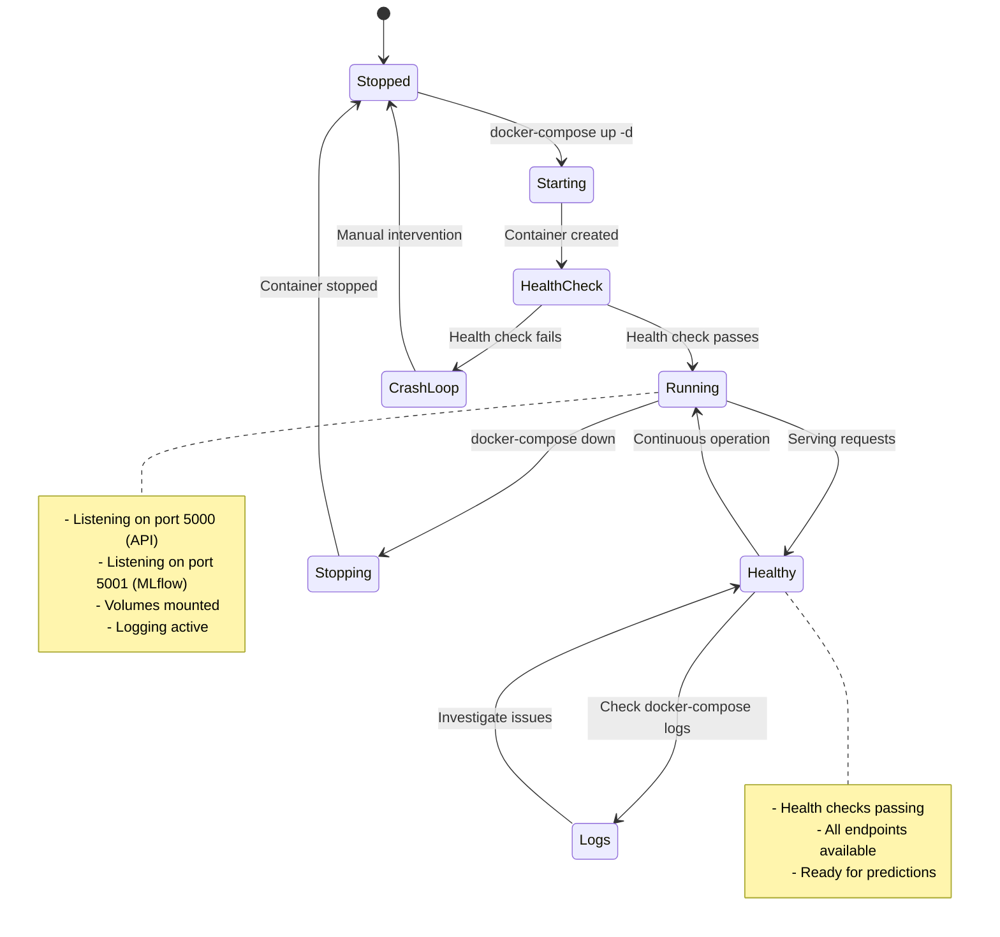
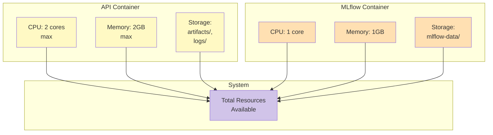
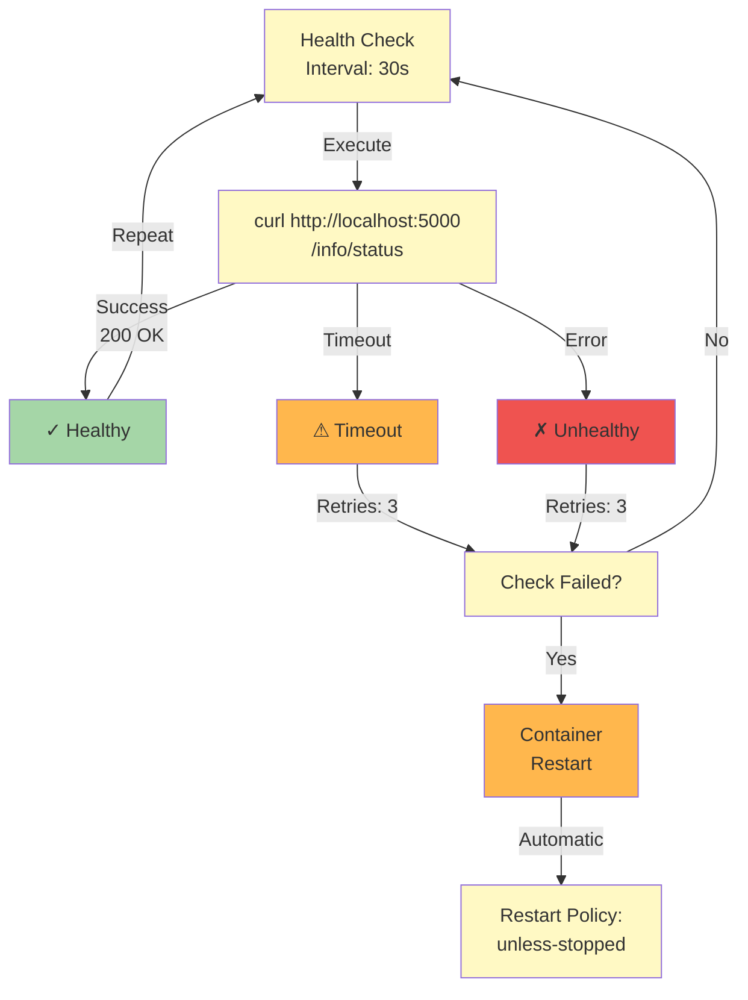
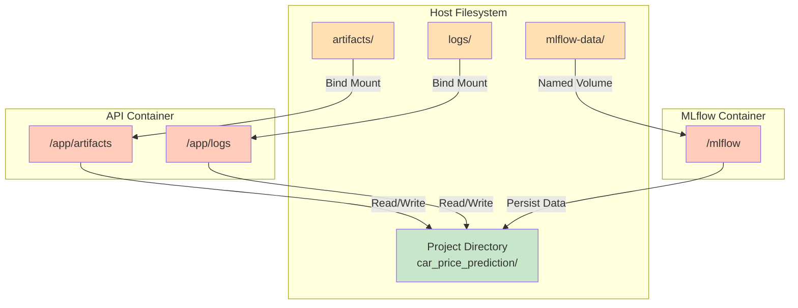
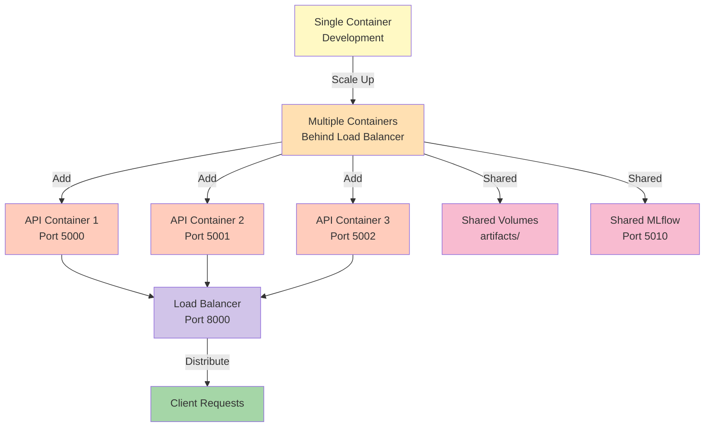

# Deployment Architecture

This document describes the containerization and deployment architecture using Docker and docker-compose.

## Docker Multi-Stage Build Process

## Docker Compose Services Architecture

## Container Communication

## Deployment Workflow

## Container Lifecycle

## Resource Management

## Health Check Mechanism

## Volume Mounting Strategy

## Scaling Strategy

---

## Key Deployment Features

✅ **Multi-Stage Docker Build** - Optimized image size  
✅ **Non-Root User** - Security best practice  
✅ **Health Checks** - Automatic restart on failure  
✅ **Volume Persistence** - Data survives container restart  
✅ **Network Isolation** - Service communication via bridge network  
✅ **Restart Policy** - Automatic recovery  
✅ **Environment Variables** - Configuration management  

