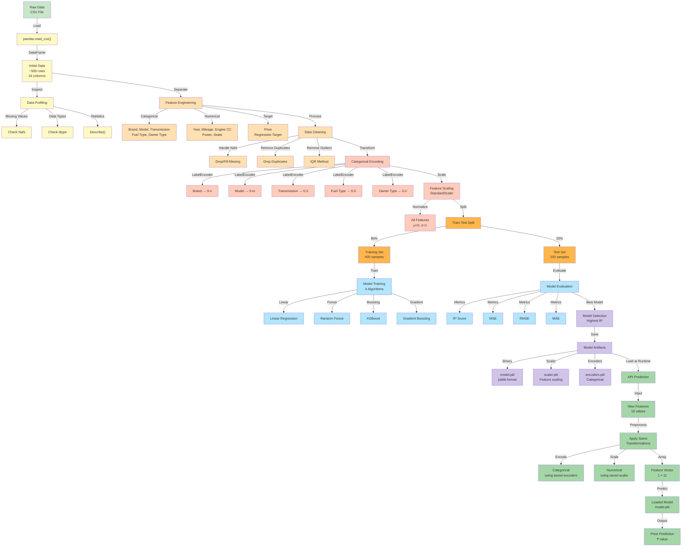
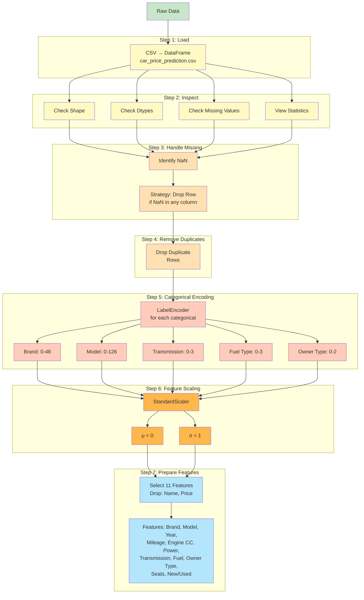
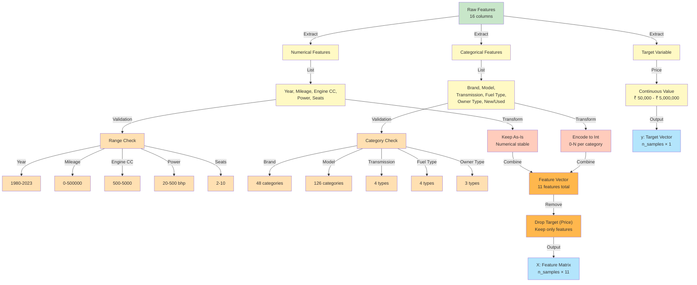
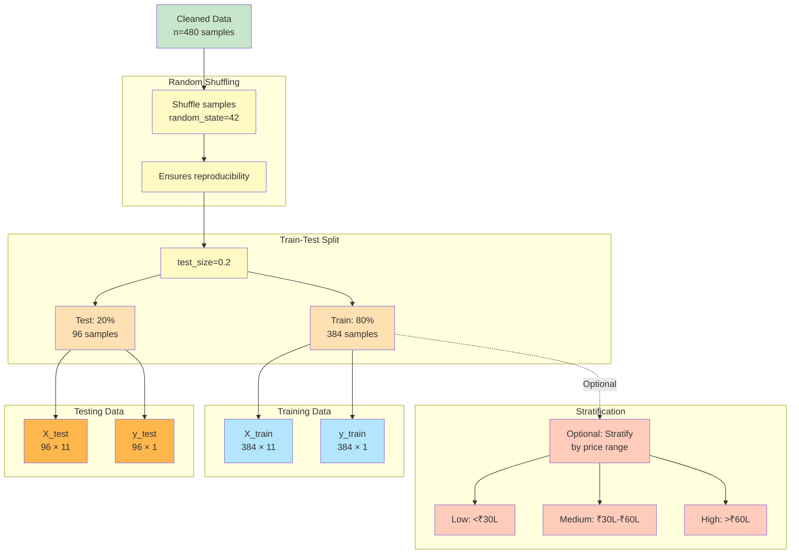
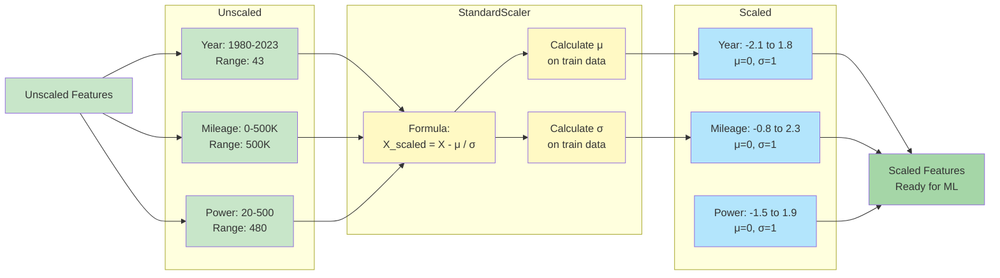
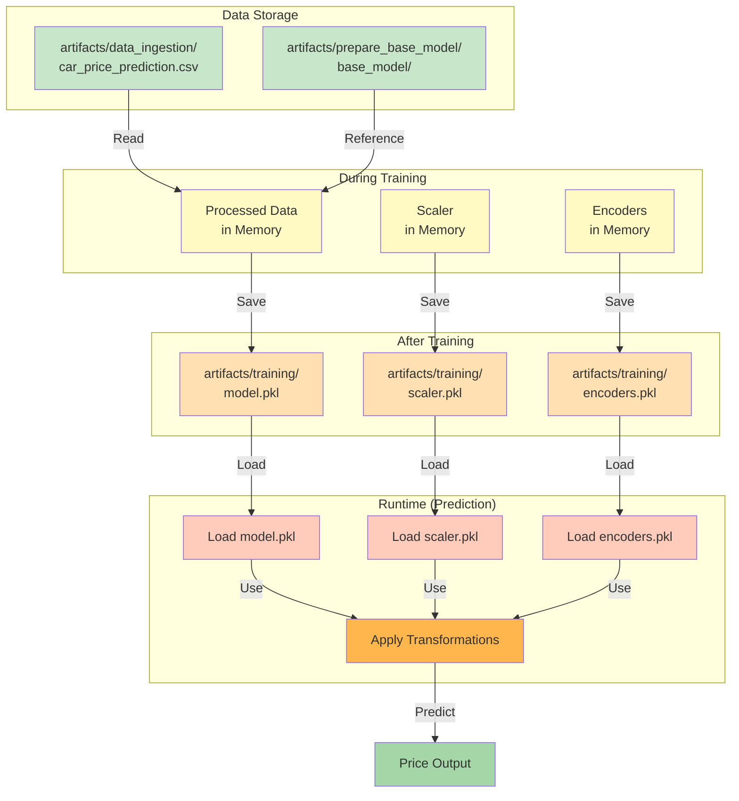
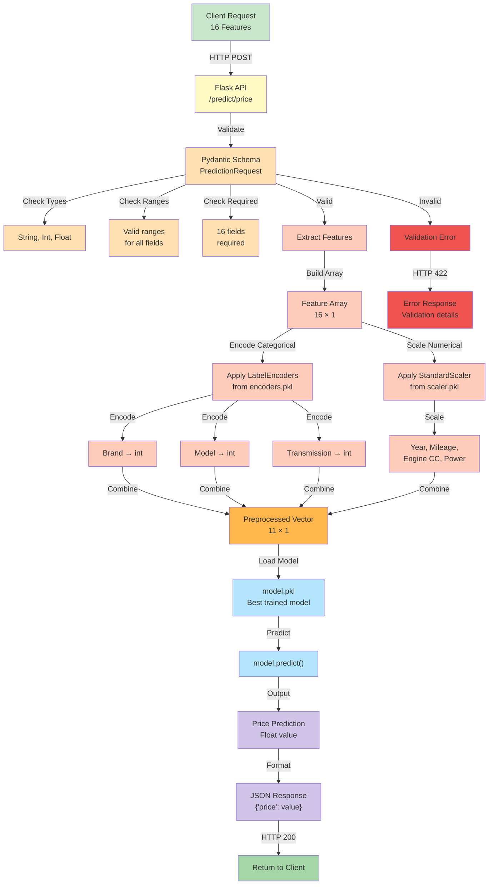

# Data Flow

This document describes how data flows through the entire system, from ingestion to prediction.

## Complete Data Processing Pipeline

## Data Preprocessing Details

## Feature Engineering Process

## Train-Test Split Strategy

## Feature Scaling Pipeline

## Data Storage and Retrieval

## Prediction Request Data Flow

---

## Data Flow Summary

- **Raw Data → Preprocessing** (8 steps of cleaning and transformation)
- **Features → Scaling** (StandardScaler with μ=0, σ=1)
- **Train/Test Split** (80:20 ratio with reproducibility)
- **Model Training** (4 algorithms compared)
- **Artifacts Storage** (model, scaler, encoders saved)
- **Runtime Prediction** (exact same transformations applied)

