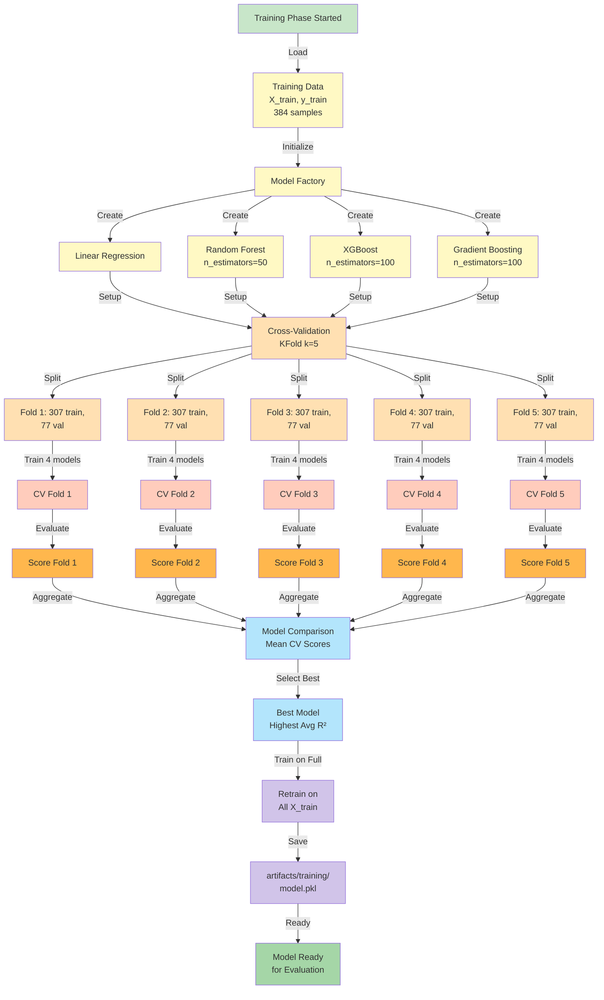
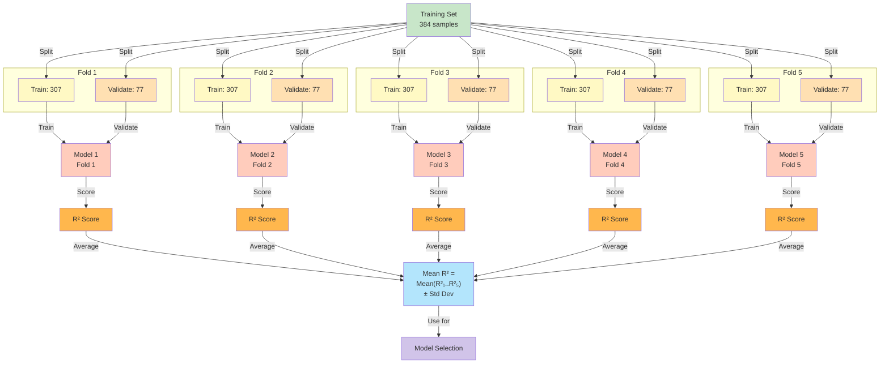
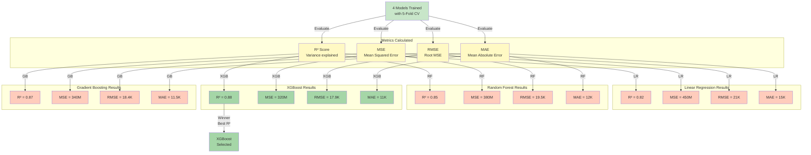
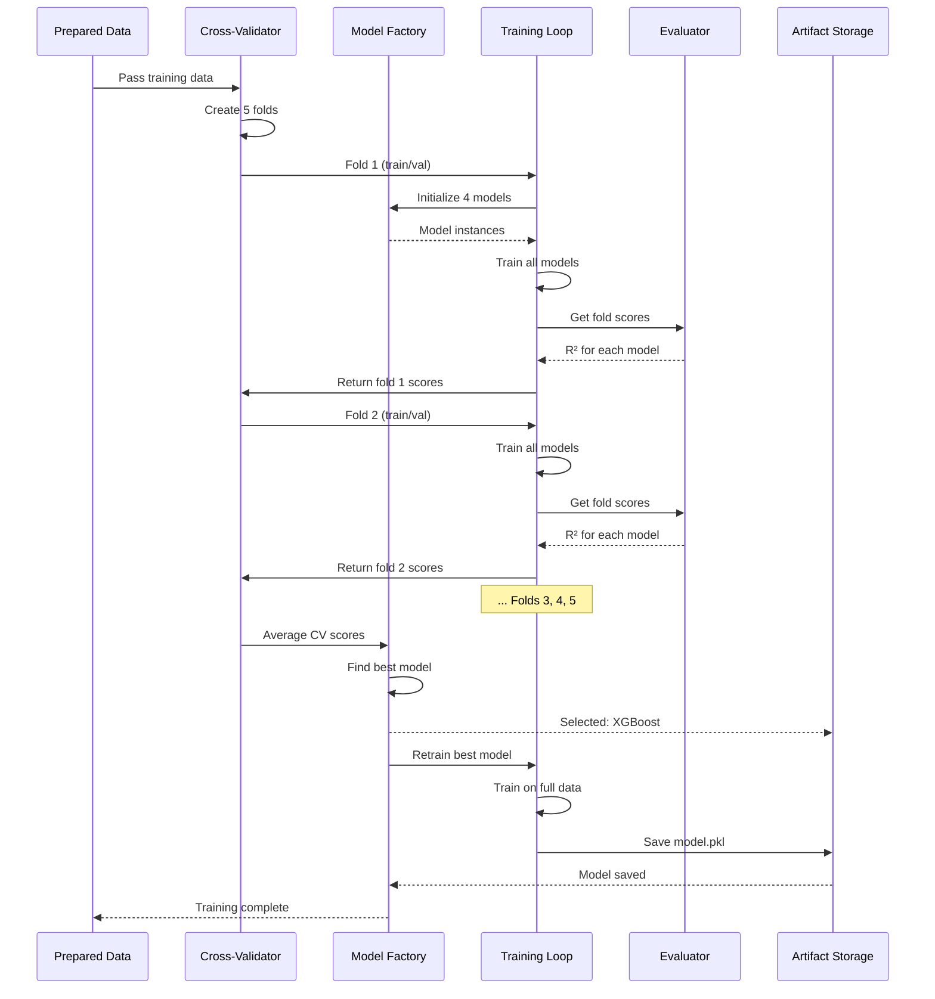
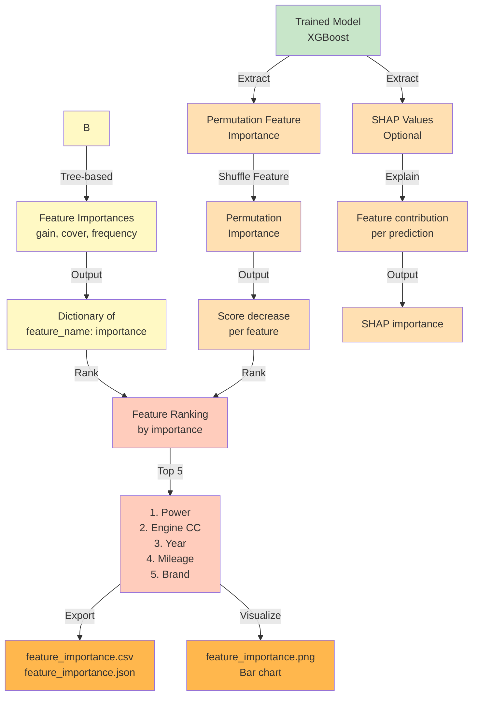
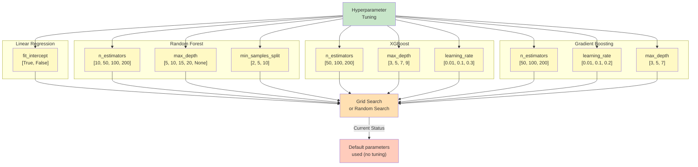
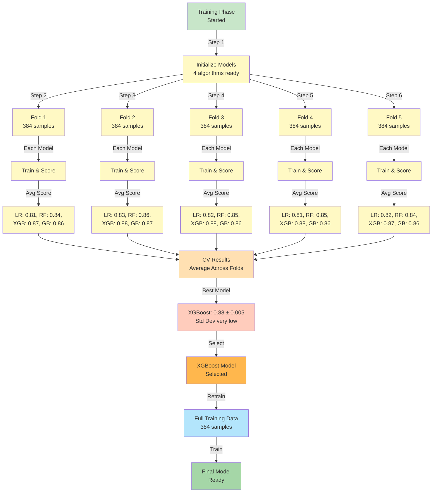

# Model Training Workflow

This document details the model training process, including cross-validation, hyperparameter optimization, and model selection.

## Complete Training Workflow

## Cross-Validation Strategy (5-Fold)

## Model Comparison Metrics

## Training Stage Sequence

## Feature Importance Extraction

## Hyperparameter Grid (Potential)

## Training Performance Metrics Timeline

---

## Training Summary

**Process:**
- 5-fold cross-validation ensures robust model evaluation
- 4 algorithms compared fairly on same data splits
- Best model (XGBoost) selected by R² score
- Feature importance calculated for model interpretability

**Selected Model:** XGBoost with R² ≈ 0.88 (88% variance explained)

**Validation Strategy:** Stratified 5-fold cross-validation with reproducible random state

