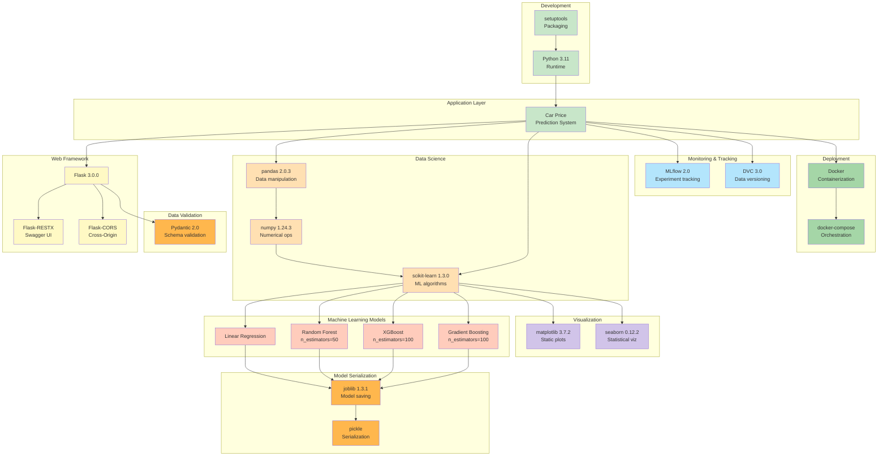
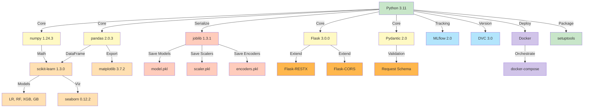
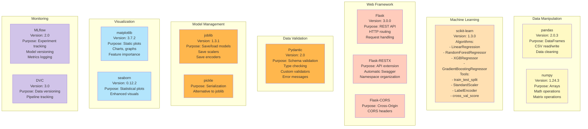
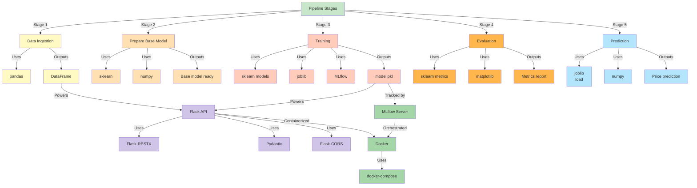
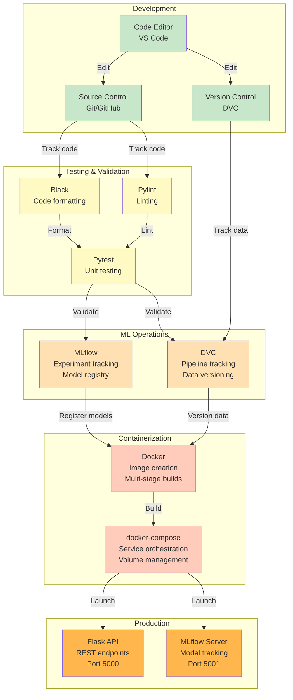
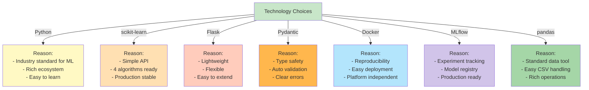

# Technology Stack

This document provides a comprehensive overview of all technologies, libraries, and tools used in the Car Price Prediction project.

## Complete Technology Stack Architecture

## Dependency Tree

## Core Libraries Details

## Integration Points

## Version Matrix

```mermaid
graph TB
    subgraph "Core Runtime"
        PYTHON["Python 3.11.0<br/>Latest stable<br/>Linux/Mac/Windows"]
    end
    
    subgraph "Data Stack (Latest)"
        PANDAS["pandas 2.0.3"]
        NUMPY["numpy 1.24.3"]
    end
    
    subgraph "ML Stack (Latest)"
        SK["scikit-learn 1.3.0"]
        JOBLIB["joblib 1.3.1"]
    end
    
    subgraph "Web Framework (Latest)"
        FLASK["Flask 3.0.0"]
        RESTX["Flask-RESTX"]
        CORS["Flask-CORS"]
    end
    
    subgraph "Validation (Latest)"
        PYDANTIC["Pydantic 2.0"]
    end
    
    subgraph "Visualization (Latest)"
        MPL["matplotlib 3.7.2"]
        SEABORN["seaborn 0.12.2"]
    end
    
    subgraph "DevOps (Latest)"
        MLFLOW["MLflow 2.0"]
        DVC["DVC 3.0"]
        DOCKER["Docker (latest)"]
    end
    
    PYTHON --> PANDAS & NUMPY & SK & FLASK & PYDANTIC & MPL & MLFLOW
    
    style PYTHON fill:#c8e6c9
    style PANDAS fill:#fff9c4
    style NUMPY fill:#fff9c4
    style SK fill:#ffe0b2
    style JOBLIB fill:#ffe0b2
    style FLASK fill:#ffccbc
    style RESTX fill:#ffccbc
    style CORS fill:#ffccbc
    style PYDANTIC fill:#ffb74d
    style MPL fill:#b3e5fc
    style SEABORN fill:#b3e5fc
    style MLFLOW fill:#d1c4e9
    style DVC fill:#d1c4e9
    style DOCKER fill:#a5d6a7
```

## Development & Deployment Tools

## Technology Selection Rationale

---

## Summary

**Total Dependencies:** 20+ libraries  
**Python Version:** 3.11 (latest stable)  
**Latest Package Versions:** All major packages at latest stable versions  
**Compatibility:** Tested on Python 3.11, Docker available for containerization  

**Key Technology Categories:**
- **Data Processing:** pandas, numpy
- **Machine Learning:** scikit-learn, 4 algorithms
- **Web API:** Flask, Flask-RESTX, Pydantic
- **Model Management:** joblib, MLflow
- **Visualization:** matplotlib, seaborn
- **Deployment:** Docker, docker-compose
- **Version Control:** Git, DVC

