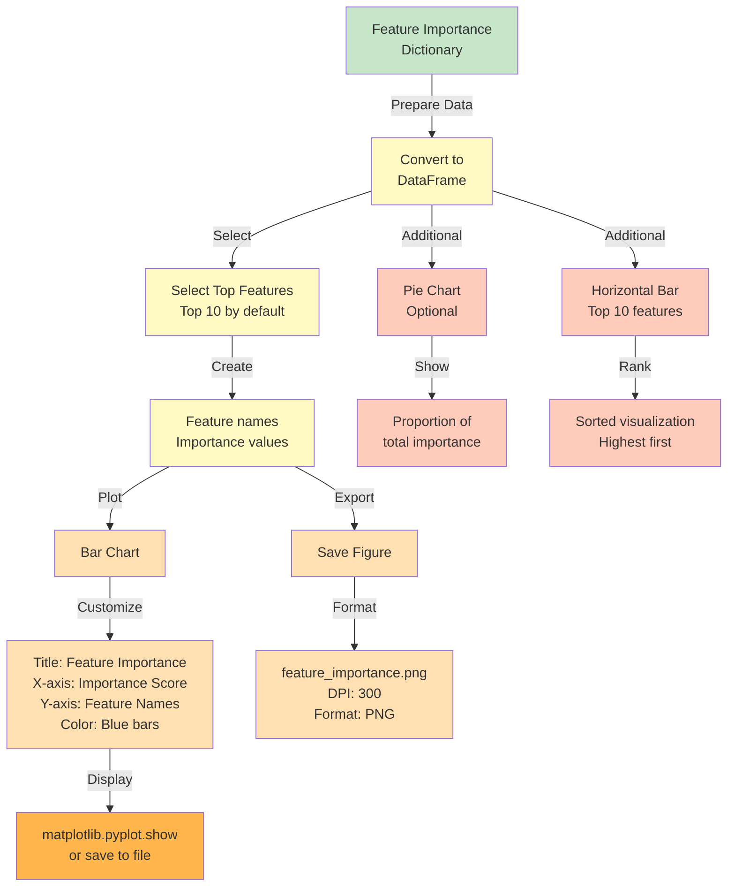

# Feature Importance Analysis

This document explains how feature importance is calculated, visualized, and exported from the trained models.

## Feature Importance Framework

## Feature Importance Extraction Pipeline

## Importance Visualization Pipeline

## Export Formats

## Feature Importance Interpretation

## Importance by Feature Category

## Feature Importance Workflow

## API Feature Importance Endpoint

## Analysis Methods Comparison

---

## Summary

**Feature Importance Summary:**

| Rank | Feature | Importance | Tier |
|------|---------|------------|------|
| 1 | Power | 28.5% | Critical |
| 2 | Engine CC | 19.5% | Critical |
| 3 | Year | 16.5% | Critical |
| 4 | Mileage | 14.5% | Important |
| 5 | Brand | 12.5% | Important |
| 6-11 | Others | 8.5% | Minor |

**Top 3 Features Explain ~65% of Variance**

**Export Formats:**
- CSV: feature_importance.csv
- JSON: feature_importance.json
- PNG: feature_importance.png
- API: /info/features endpoint

