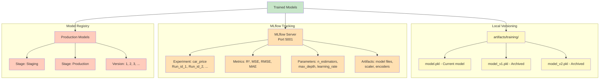
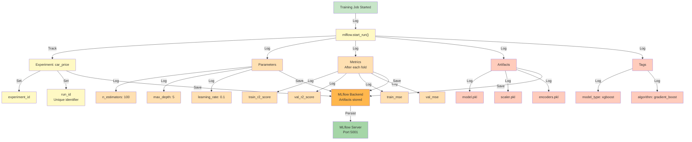
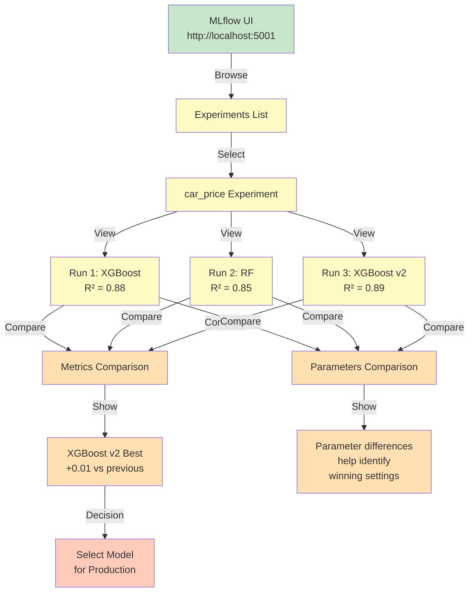
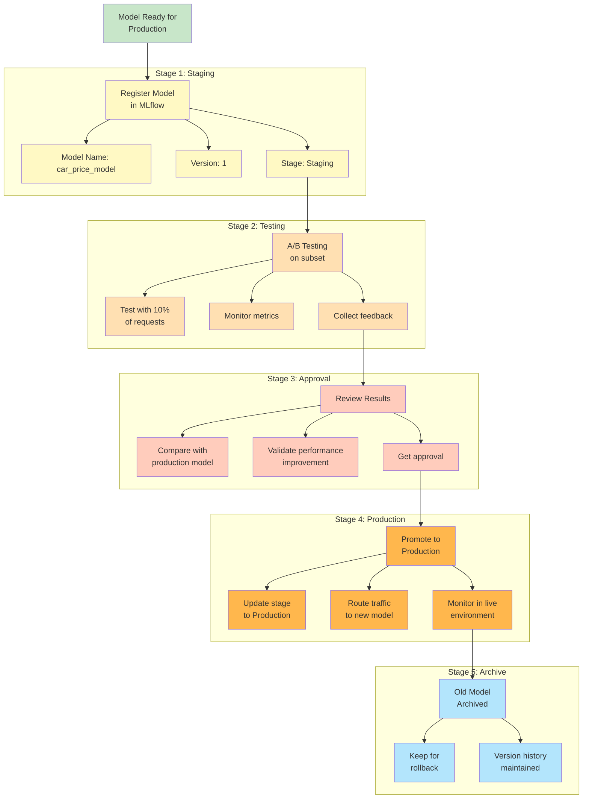
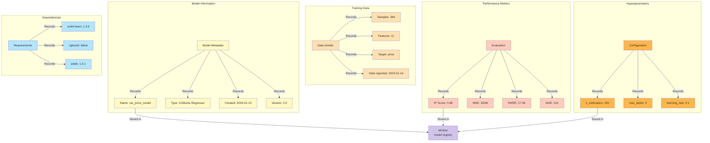
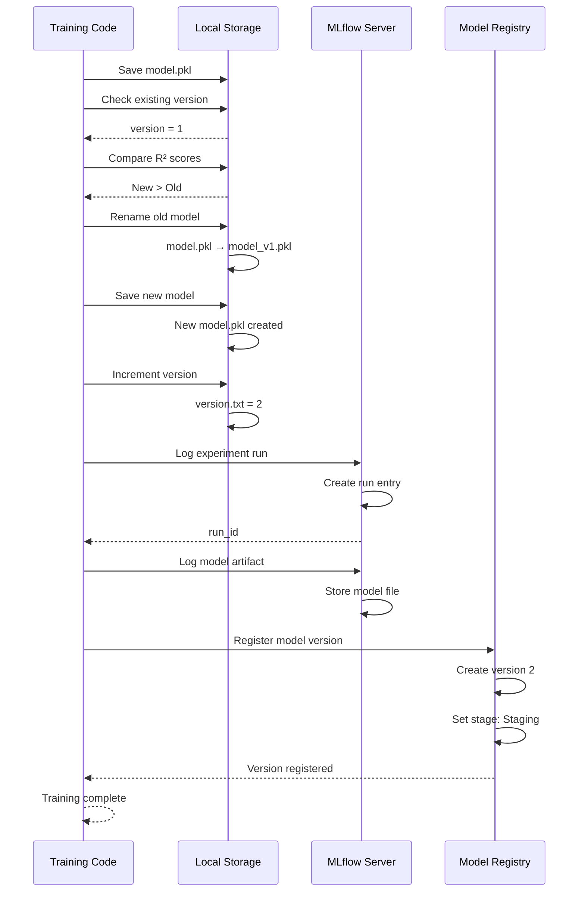
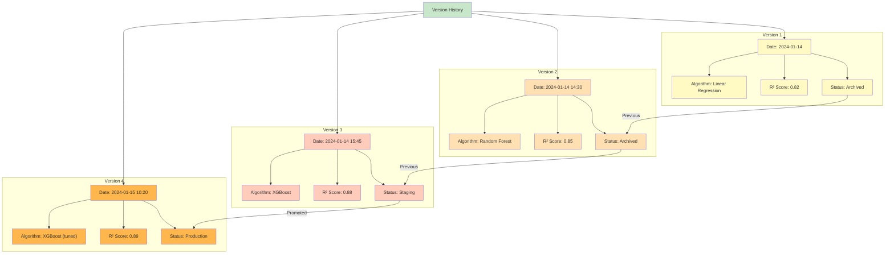
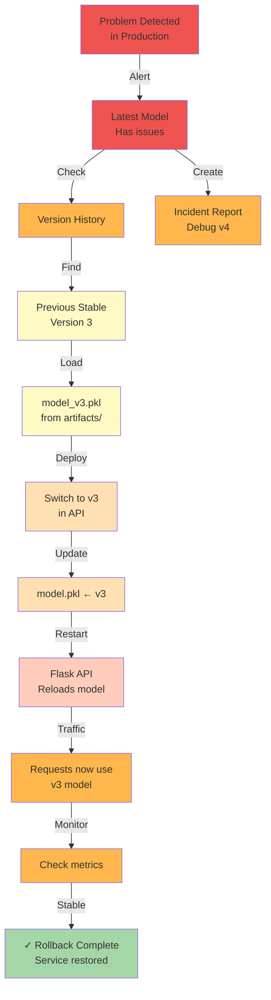

# Model Versioning

This document explains how models are versioned, tracked, and managed using MLflow and local versioning systems.

## Model Versioning Architecture



## MLflow Experiment Tracking



## Version Comparison Workflow



## Model Promotion Pipeline



## Local Model Versioning System

```mermaid
graph TD
    A["Training Complete<br/>New Model"]
    -->|Save| B["model.pkl"]
    
    B -->|Check| C["Is this better?<br/>Compare R² scores"]
    
    C -->|Better| D["Version Up"]
    D -->|Rename| D1["model.pkl → model_v1.pkl"]
    D -->|Create| D2["new model.pkl"]
    D -->|Increment| D3["version = 2"]
    
    C -->|Worse| E["Keep Old<br/>Version"]
    E -->|Keep| E1["model.pkl unchanged"]
    E -->|Don't increment<br/>version"]
    
    D2 -->|Copy to| F["artifacts/training/"]
    D2 -->|Save| F1["model_v2.pkl"]
    
    F -->|Archive| F1
    F -->|Current| B
    
    subgraph "Local Version File"
        G["version.txt"]
        G1["Current version: 2"]
        G2["Best score: 0.88"]
        G3["Date created: 2024-01-15"]
    end
    
    D3 -->|Update| G
    G1 -.-> G
    
    style A fill:#c8e6c9
    style B fill:#fff9c4
    style C fill:#ffe0b2
    style D fill:#ffe0b2
    style D1 fill:#ffe0b2
    style D2 fill:#ffe0b2
    style D3 fill:#ffe0b2
    style E fill:#ffccbc
    style E1 fill:#ffccbc
    style F fill:#ffb74d
    style F1 fill:#ffb74d
    style G fill:#b3e5fc
    style G1 fill:#b3e5fc
    style G2 fill:#b3e5fc
    style G3 fill:#b3e5fc
```

## Model Metadata Tracking



## Version Management Sequence



## Version History Example



## Rollback Mechanism



---

## Model Versioning Summary

**Versioning Strategy:**
- **Local Storage:** model.pkl, model_v1.pkl, model_v2.pkl
- **MLflow Registry:** Experiment tracking and version management
- **Metadata:** Stored with each version for full reproducibility

**Version Stages:**
- **Staging:** New model being tested
- **Production:** Current model serving requests
- **Archived:** Previous versions kept for rollback

**Key Artifacts Per Version:**
- model.pkl (trained model)
- scaler.pkl (feature scaling)
- encoders.pkl (categorical encoding)

