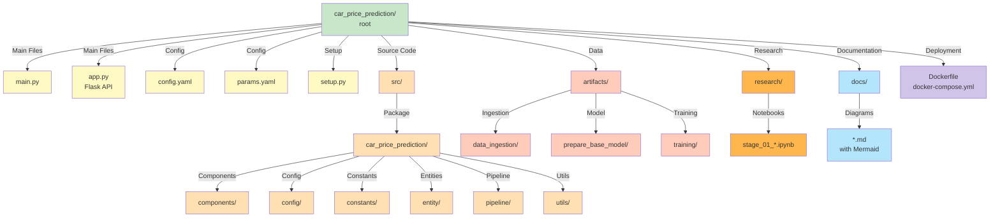
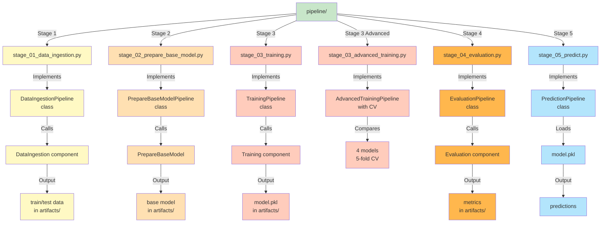
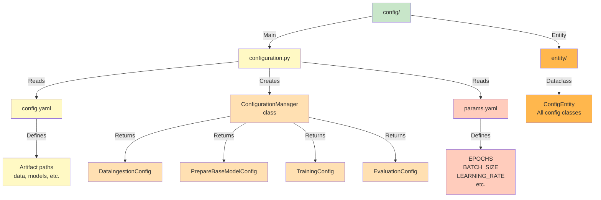
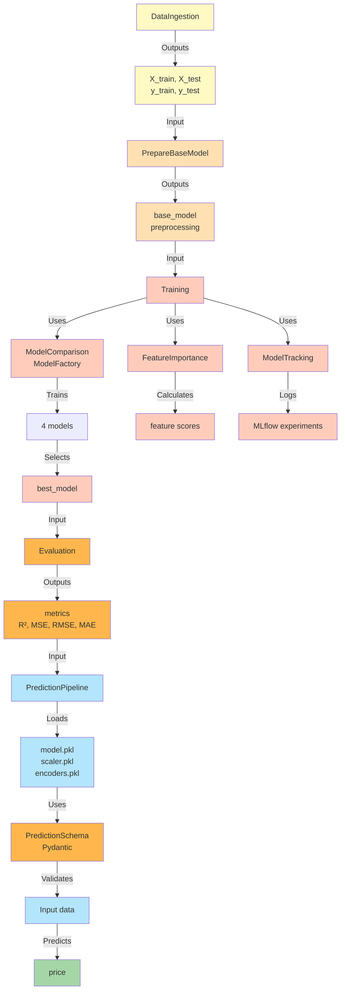
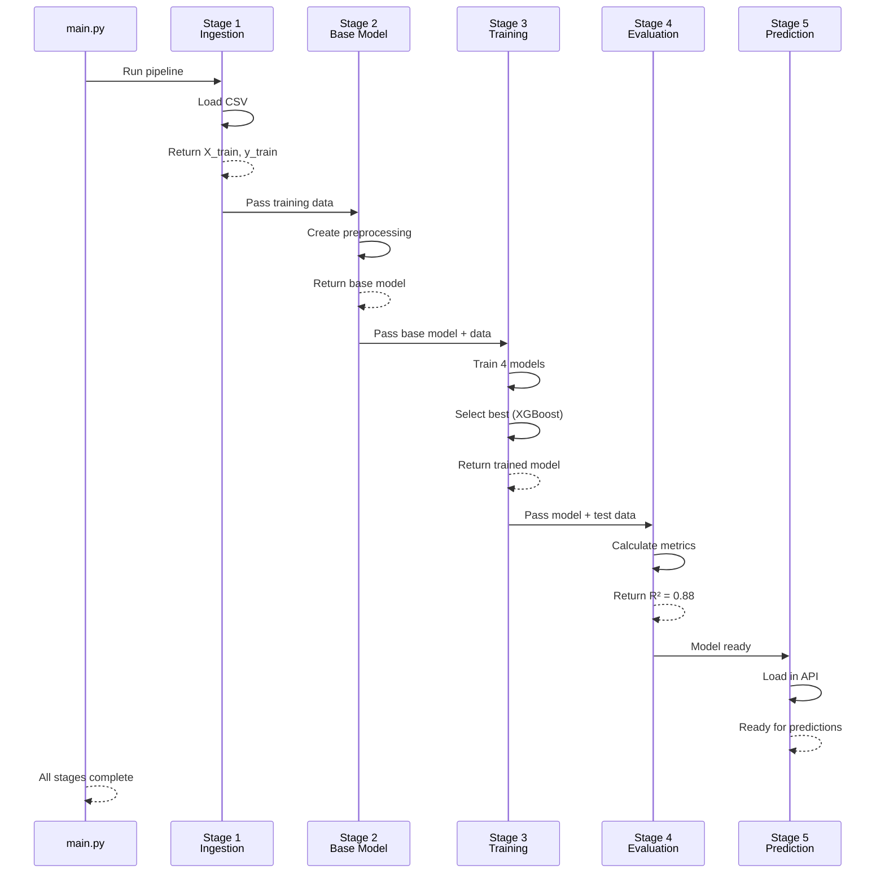
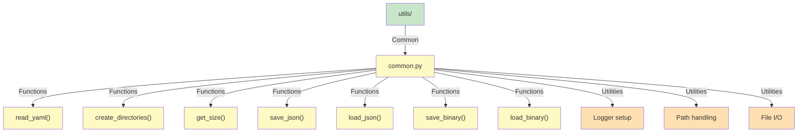
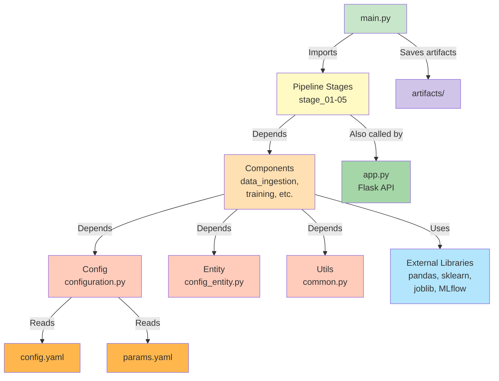
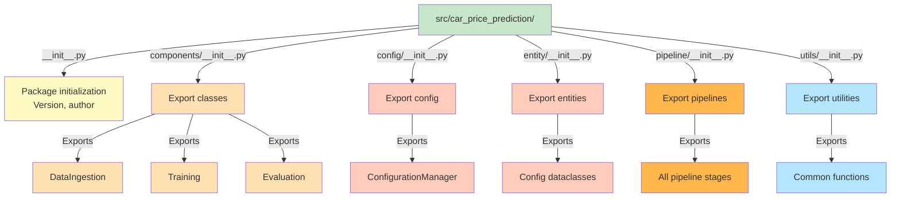
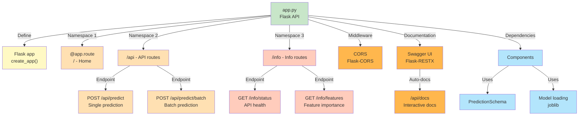

# Code Structure

This document outlines the project's module organization, class hierarchies, and component dependencies.

## Project Directory Structure

## Components Organization

```mermaid
graph TD
    A["components/"]
    
    A -->|Stage 1| B["data_ingestion.py<br/>DataIngestion class"]
    B -->|Reads| B1["CSV files"]
    B -->|Outputs| B2["DataFrames"]
    
    A -->|Stage 2| C["prepare_base_model.py<br/>PrepareBaseModel class"]
    C -->|Creates| C1["Base model<br/>with preprocessing"]
    
    A -->|Stage 3| D["training.py<br/>Training class"]
    D -->|Trains| D1["ML models"]
    D -->|Saves| D2["model.pkl"]
    
    A -->|Stage 4| E["evaluation.py<br/>Evaluation class"]
    E -->|Calculates| E1["Metrics"]
    
    A -->|Stage 5| F["prepare_callbacks.py<br/>Callbacks class"]
    F -->|Manages| F1["Training callbacks<br/>Logging, saving"]
    
    A -->|Advanced| G["model_comparison.py<br/>ModelComparison"]
    G -->|Compares| G1["4 algorithms"]
    
    A -->|Advanced| H["feature_importance.py<br/>FeatureImportance"]
    H -->|Calculates| H1["Importance scores"]
    
    A -->|Validation| I["prediction_schema.py<br/>PredictionRequest"]
    I -->|Validates| I1["16 fields"]
    
    A -->|Tracking| J["model_tracking.py<br/>ModelTracking"]
    J -->|Tracks| J1["Versions<br/>Experiments"]
    
    style A fill:#c8e6c9
    style B fill:#fff9c4
    style B1 fill:#fff9c4
    style B2 fill:#fff9c4
    style C fill:#ffe0b2
    style C1 fill:#ffe0b2
    style D fill:#ffe0b2
    style D1 fill:#ffe0b2
    style D2 fill:#ffe0b2
    style E fill:#ffccbc
    style E1 fill:#ffccbc
    style F fill:#ffccbc
    style F1 fill:#ffccbc
    style G fill:#ffb74d
    style G1 fill:#ffb74d
    style H fill:#ffb74d
    style H1 fill:#ffb74d
    style I fill:#b3e5fc
    style I1 fill:#b3e5fc
    style J fill:#d1c4e9
    style J1 fill:#d1c4e9
```

## Pipeline Stages Structure

## Configuration Architecture

## Class Hierarchy and Relationships

## Data Flow Through Modules

## Utils Module Organization

## Dependencies Between Modules

## Module Import Structure

## API Module Structure

---

## Code Organization Summary

**Total Modules:** 20+ Python files  
**Main Components:** 8 core classes  
**Pipeline Stages:** 5 sequential stages  
**Configuration:** Centralized via YAML files  

**Key Organization Principles:**
- ✅ Modular design (each stage independent)
- ✅ Configuration-driven (params in YAML)
- ✅ Reusable components (classes for each function)
- ✅ Clear dependency flow (stage → component → util)
- ✅ API integration (Flask endpoints)
- ✅ Type safety (dataclasses and Pydantic)

