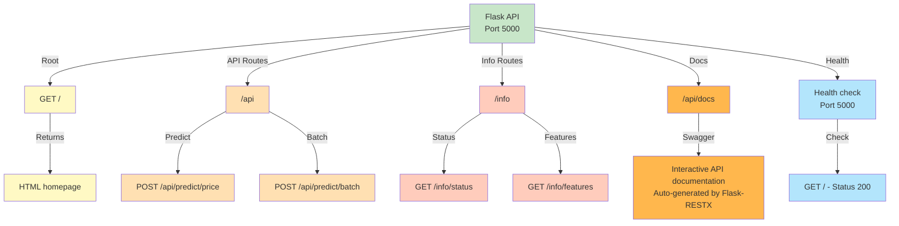
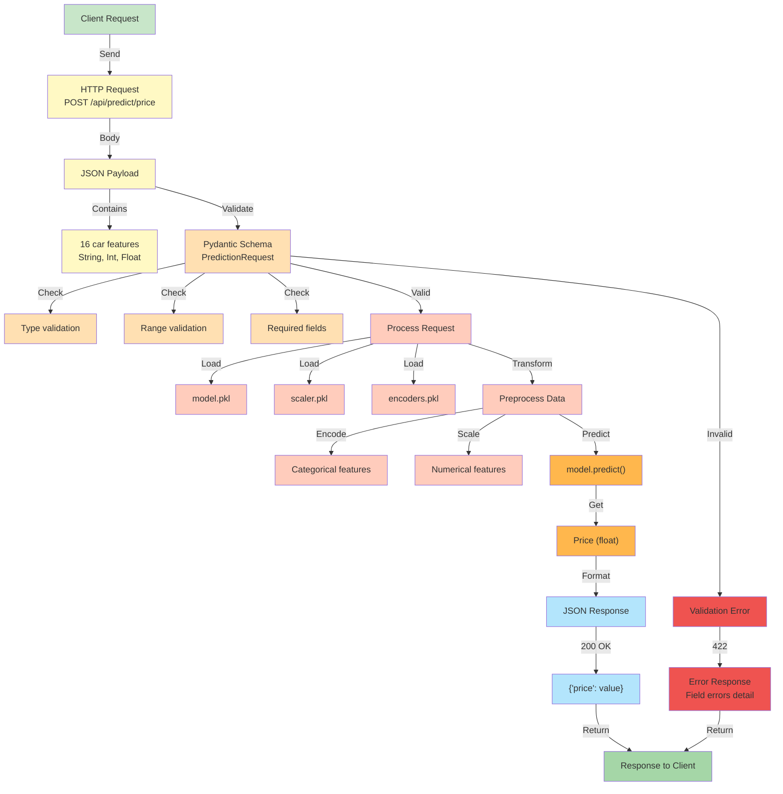
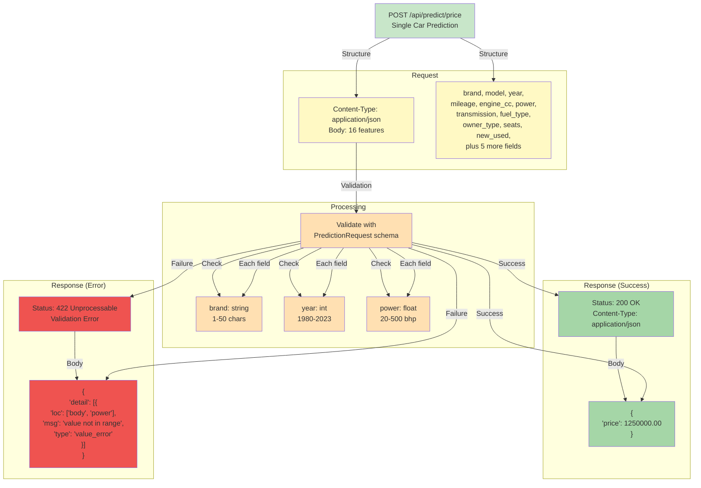
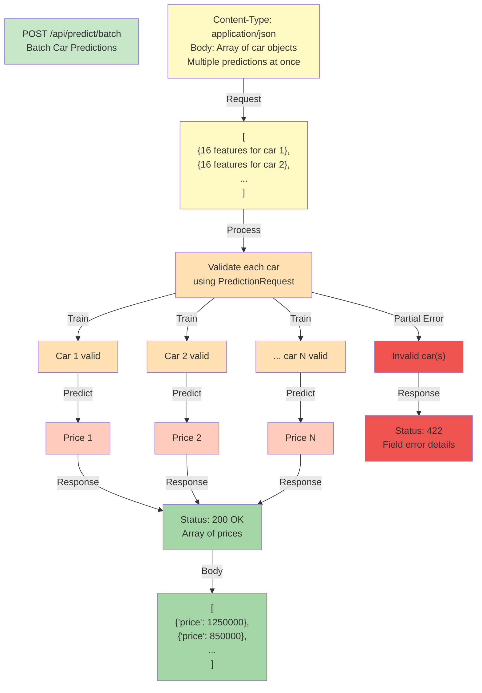
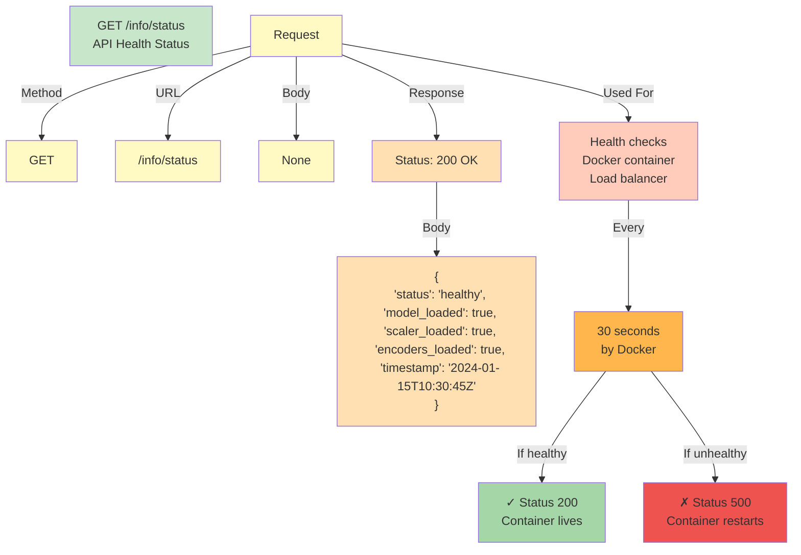
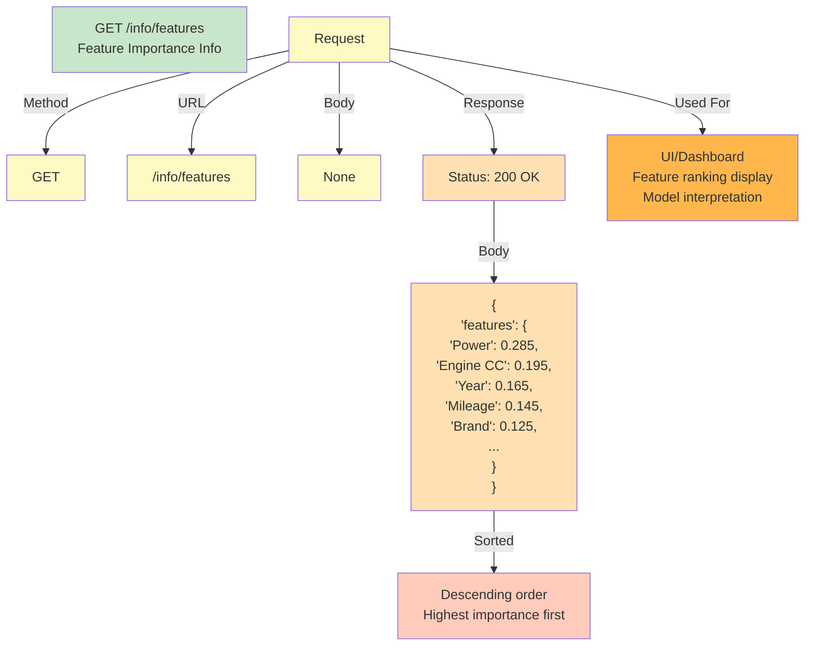
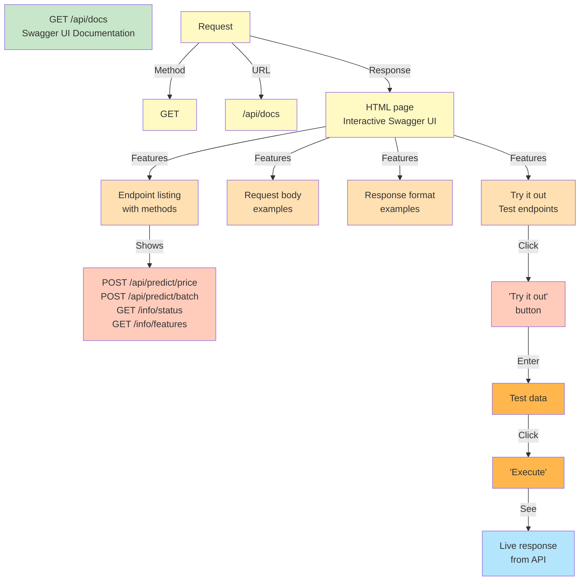
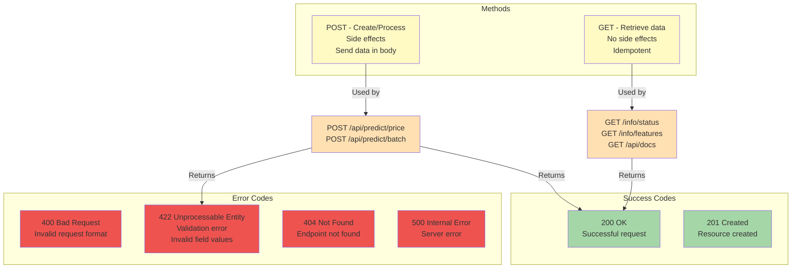
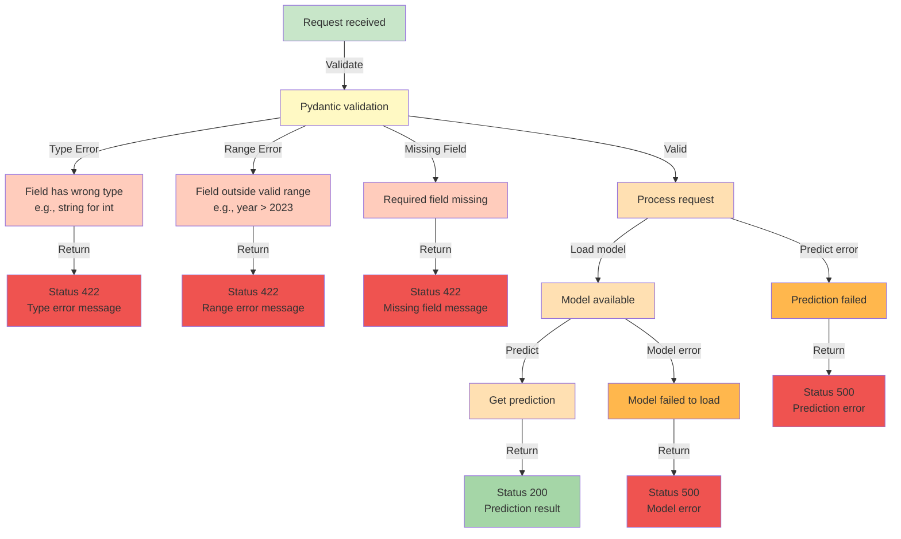
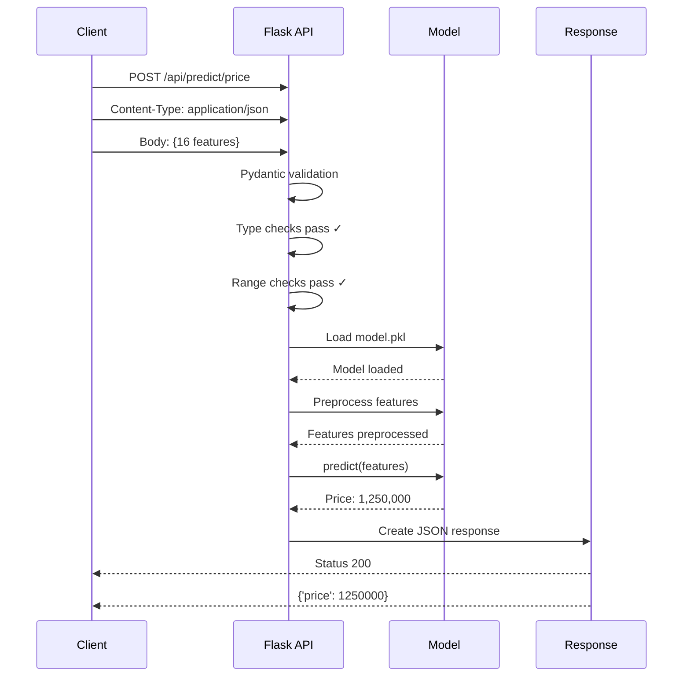

# API Endpoints

This document provides a comprehensive reference of all API endpoints, their methods, parameters, and responses.

## API Endpoints Overview

## Request/Response Model

## Single Prediction Endpoint

## Batch Prediction Endpoint

## Status Information Endpoint

## Features Information Endpoint

## API Documentation Endpoint

## HTTP Methods & Status Codes

## Error Handling Flow

## Request Example Sequence

---

## API Endpoints Summary Table

| Endpoint | Method | Purpose | Input | Output | Status |
|----------|--------|---------|-------|--------|--------|
| `/` | GET | Home page | None | HTML | 200 |
| `/api/predict/price` | POST | Single prediction | 16 fields | Price | 200/422 |
| `/api/predict/batch` | POST | Batch prediction | Array | Prices array | 200/422 |
| `/info/status` | GET | Health check | None | Status JSON | 200 |
| `/info/features` | GET | Feature importance | None | Features JSON | 200 |
| `/api/docs` | GET | Swagger UI | None | HTML docs | 200 |

**Total Endpoints:** 6 (5 functional + 1 documentation)  
**Primary Methods:** GET, POST  
**Response Format:** JSON (except home and docs)  
**Auth:** None (public API)  

