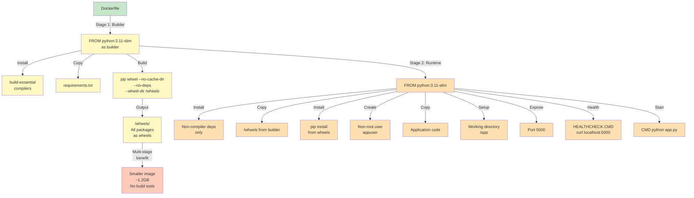
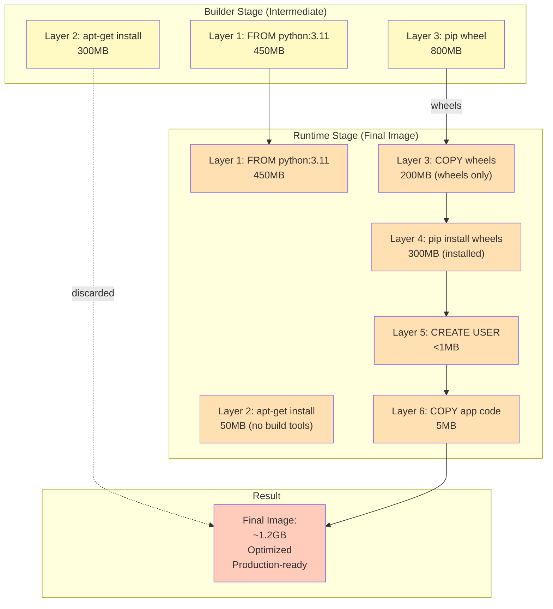
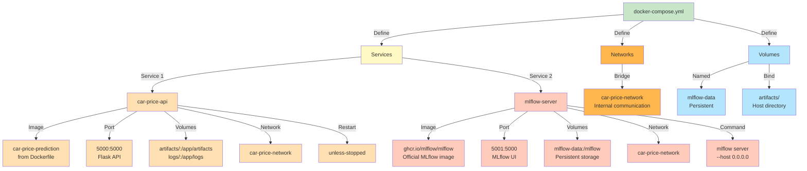
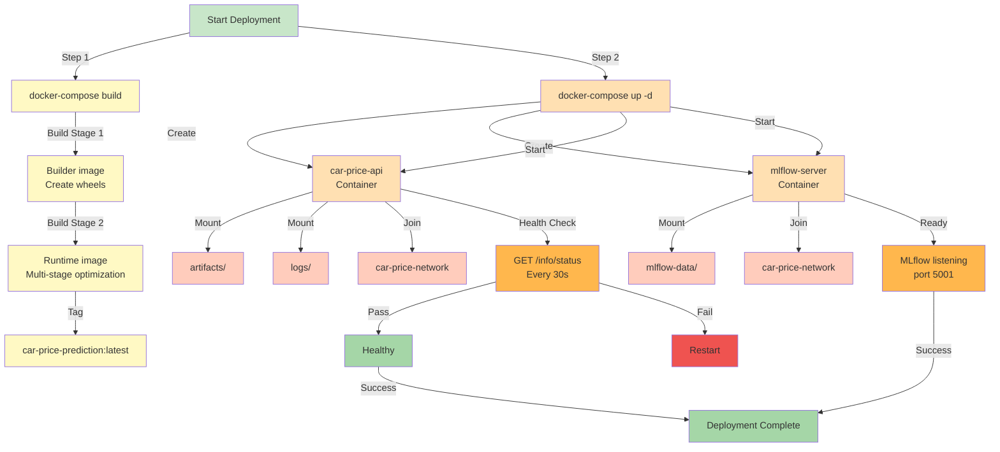
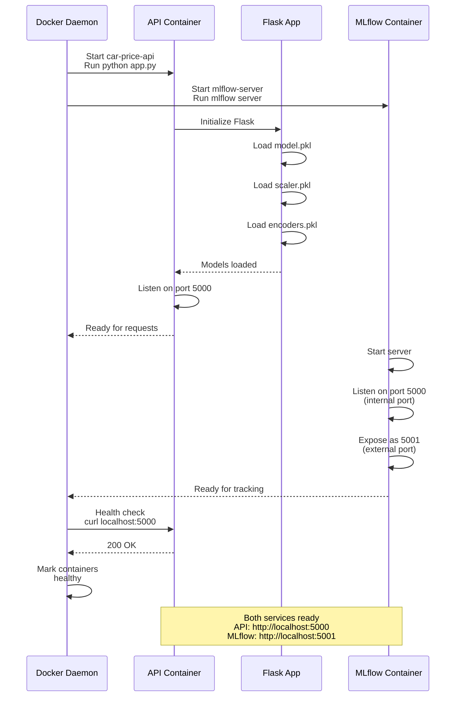
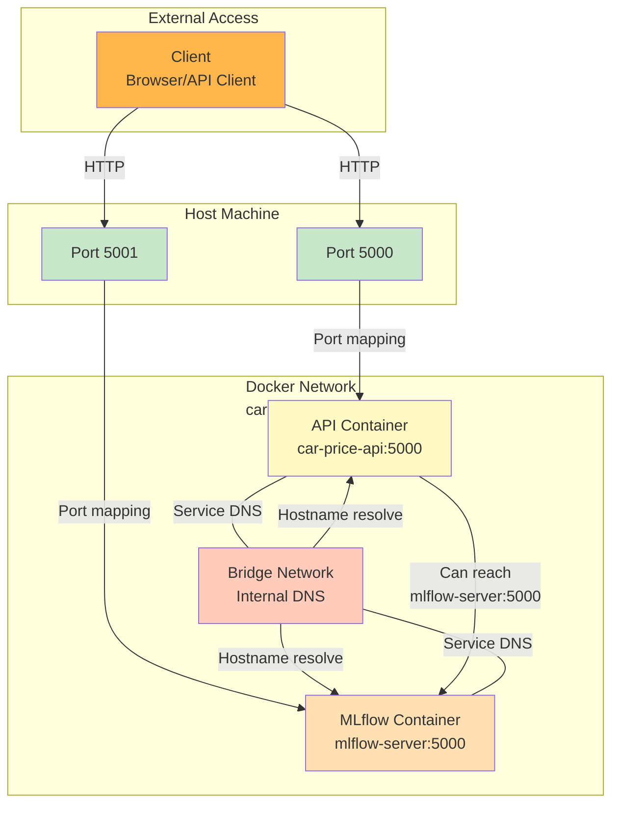
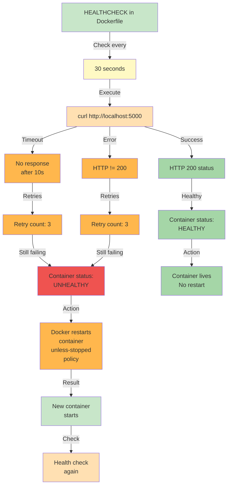
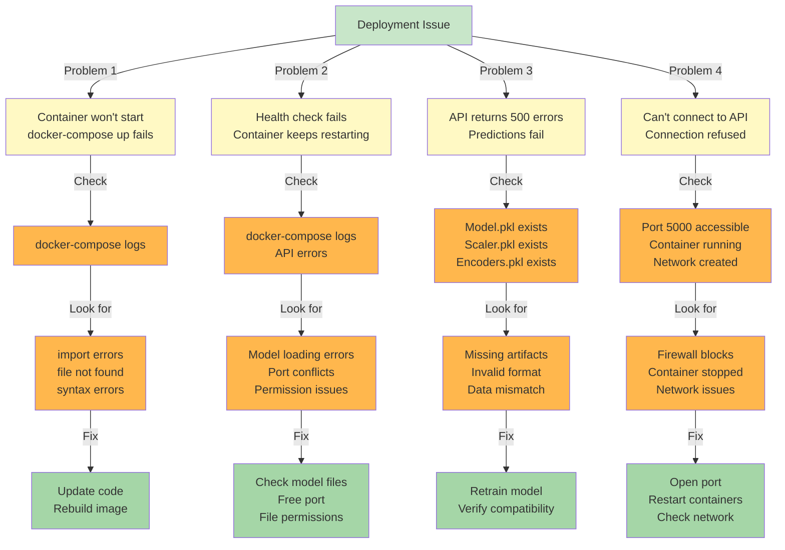
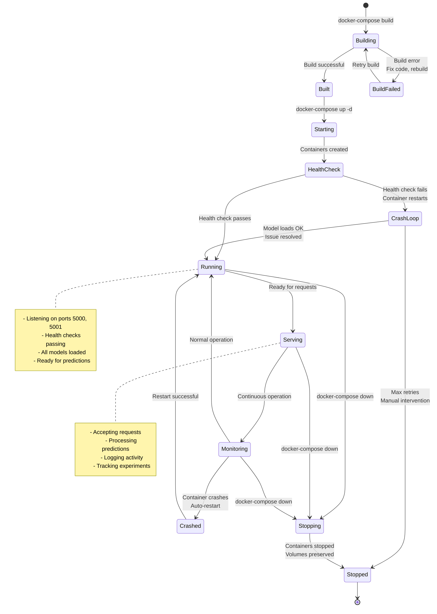
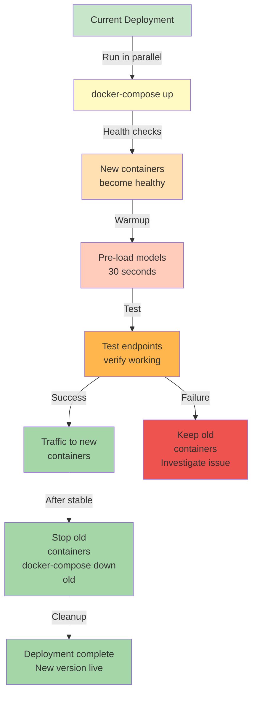

# Deployment Pipeline

This document details the complete build, deployment, and service startup process using Docker and docker-compose.

## Complete Build Process



## Docker Image Layers



## docker-compose Orchestration



## Deployment Command Sequence



## Container Startup Sequence



## Network Communication



## Health Check Mechanism



## Deployment Troubleshooting



## Deployment Lifecycle



## Rollout Strategy



---

## Deployment Commands Reference

**Build image:**
```bash
docker-compose build
```

**Start services:**
```bash
docker-compose up -d
```

**View logs:**
```bash
docker-compose logs -f car-price-api
docker-compose logs -f mlflow-server
```

**Check status:**
```bash
docker-compose ps
```

**Stop services:**
```bash
docker-compose down
```

**Restart services:**
```bash
docker-compose restart
```

**Remove volumes:**
```bash
docker-compose down -v
```

